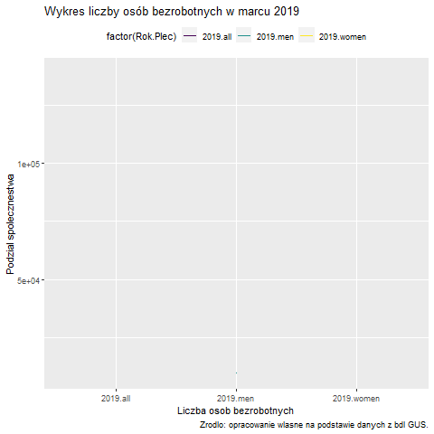
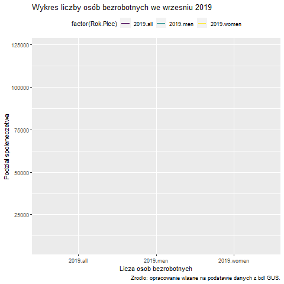
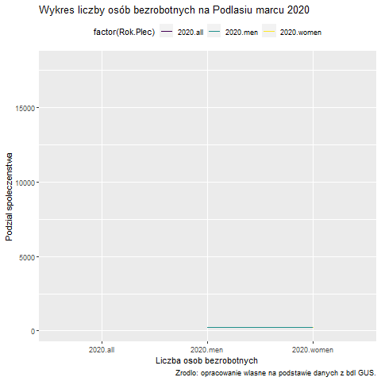
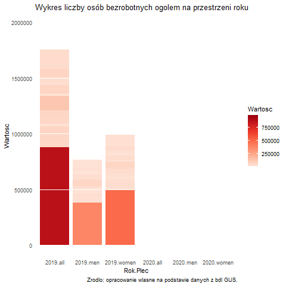

```{r setup, include=FALSE}
knitr::opts_chunk$set(echo = TRUE)
```

## Przygotowanie srodowiska do pracy
### Czyszczenie danych 
```{r czyszczenie_danych}
#rm(list = ls())
```

### Podczytanie bibilotek
```{r}
library(tidyverse)
library(readxl)
library(sf)
library(dplyr)
library(ggplot2)
library(gganimate)
library(gapminder)
```

## Sytuacja w marcu 2019 
### Podczytanie danych z pliku lokalnego sciagniatego z **bdl GUS**

Dane dotyczą **bezrobocia zarejestrowanego w Polsce wedlug plci**
```{r}
marzec_2019 <- read_excel("marzec_2019.xlsx", 
    sheet = "DANE", col_types = c("text", 
        "text", "text", "text", "text", "numeric", 
        "skip", "skip"))
```

```{r}
marzec_2019 %>% head
```

### Zmianna polskich nazw na angielskie 
```{r}
marzec_2019 <- marzec_2019 %>%
  mutate(Nazwa = str_to_title((Nazwa)),
         Plec = str_replace(Plec, "ogółem", "all"),
         Plec = str_replace(Plec, "mężczyźni", "men"),
         Plec = str_replace(Plec, "kobiety", "women"))
```

### Zmianna nazwy kolumny zawierajace nazwy wojewodztw
```{r}
names(marzec_2019)
```

```{r}
names(marzec_2019)[2] <- "NAME_1"
names(marzec_2019)
```

### Polaczenie danych
```{r}
marzec_2019 <- marzec_2019 %>%
  select(NAME_1, Kod, Miesiace, Plec, Rok, Wartosc) %>%
  unite("Rok.Plec", c(Rok, Plec), sep = ".")
```

```{r}
names(marzec_2019)[3] <- "Miesiac"
names(marzec_2019)
```


### Postac szeroka zbioru danych
```{r}
marzec_2019.w <- marzec_2019 %>%
  pivot_wider(
    names_from = Rok.Plec,
    values_from = Wartosc)
```

### Podczytanie pliku konturów wojewodztw

Dane pochodzaca ze strony [gadm.org](https://gadm.org/data.html)
```{r}
#gadm_1sf <- readRDS(file.choose())
gadm_1sf <- readRDS("dane/gadm36_POL_1_sf.rds")
```

```{r}
names(gadm_1sf)
```

### Przechowanie nazw wojewodztw
```{r}
gadm_1sf$NAME_1
```
### Dolaczenie danych do obiektu *sf* z konturami wojewodztw
```{r}
gadm_1sf.p <- gadm_1sf %>%
  as.data.frame() %>%
  left_join(marzec_2019.w) %>%
  st_as_sf()
```

### Mapa dla bezrobocia 
```{r fig.height=7, fig.width=7}
gadm_1sf.p %>%
  ggplot() +
  geom_sf(aes(fill = `2019.all`)) +
  scale_fill_gradient(low = "lightskyblue1", high = "blue") +
  theme_bw() +
  labs(title = "Liczba osob bezrobotnych zarejestrowanych w Polsce",
       subtitle = "Stan na marzec 2019",
       caption = "Zrodlo: opracowanie wlasne na podstawie danych z bdl GUS.")
```

```{r}
p + transition_reveal(Wartosc)+
   labs(title = "Wykres liczby osób bezrobotnych w marcu 2019",
       caption = "Zrodlo: opracowanie wlasne na podstawie danych z bdl GUS.")
```


## Podsumowanie ilosci osob bezrobotnych w Polsce w marcu 2019
```{r}
summary(marzec_2019.w)
```

### Sprawdzenie w jakim województwie wystepuje najwieksza liczba osob bezrobotnych
```{r}
marzec_2019.w[which(str_detect(marzec_2019.w$`2019.all`, "138787")),]
```

### Sprawdzenie w jakim wojewodztwie wystepuje najmniejsza liczba osob bezrobotnych
```{r}
marzec_2019.w[which(str_detect(marzec_2019.w$`2019.all`, "22201")),]
```


## Sytuacja w marcu 2019 w wojewodztwie podlaskim

```{r}
Podlasie_marzec_2019 <- read_excel("Podlasie_marzec_2019.xlsx", 
    sheet = "DANE")
Podlasie_marzec_2019 <- Podlasie_marzec_2019[,c(1:6)]
```

### Zmianna polskich nazw na angielskie
```{r}
Podlasie_marzec_2019 <- Podlasie_marzec_2019 %>%
   mutate(Nazwa = str_to_title((Nazwa)),
         Plec = str_replace(Plec, "ogółem", "all"),
         Plec = str_replace(Plec, "mężczyźni", "men"),
         Plec = str_replace(Plec, "kobiety", "women"))
```

```{r}
Podlasie_marzec_2019 <- Podlasie_marzec_2019 %>%
  select(Nazwa, Kod, Miesiace, Plec, Rok, Wartosc) %>%
  unite("Rok.Plec", c(Rok, Plec), sep = ".")
```  
 
```{r}  
names(Podlasie_marzec_2019)[3] <- "Miesiac"
names(Podlasie_marzec_2019)
```

### Postac szeroka zbioru danych
```{r}
Podlasie_marzec_2019.w <- Podlasie_marzec_2019 %>%
  pivot_wider(
    names_from = Rok.Plec,
    values_from = Wartosc)
```    

```{r}
p_podlaskie <- Podlasie_marzec_2019.w %>%
  filter(str_sub(Kod, start = 1, end = 2) == "20") %>%
  mutate(Podlasie = Nazwa)
```  
### Podczytanie pliku konturow powiatow wojewodztwa podlaskiego

Dane pochodza ze strony [gadm.org](https://gadm.org/data.html)
```{r}  
#gadm_2sf <- readRDS(file.choose())
gadm_2sf <- readRDS("dane/gadm36_POL_2_sf.rds")
```

```{r}
g_podlaskie <- gadm_2sf %>%
  filter(NAME_1 == "Podlaskie") %>%
  arrange(NAME_2)
```  
  
```{r}  
p_podlaskie <- p_podlaskie %>%
  mutate(NAME_2 = g_podlaskie$NAME_2)
```  

## Ilustracja graficzna danych na mapie

```{r}
g_podlaskie %>%
  left_join(p_podlaskie) %>% 
  ggplot() +
  geom_sf(aes(fill = `2019.all`)) +
  scale_fill_gradient(low = "khaki", high = "red") +
  theme_bw() +
  theme(
    plot.title = element_text(hjust = 0.5, size = rel(1.2))) +
  labs(title = "Liczba osob bezrobotnych w powiatach wojewodztwa podlaskiego",
       caption = "Zrodlo: opracowanie wlasne na podstawie danych z bdl GUS.")
```
## Podsumowanie ilosci osob bezrobotnych w Podlasiu w marcu 2019
```{r}
summary(p_podlaskie)
```

### Sprawdzenie w jakim powiecie wystepuje najwieksza liczba osob bezrobotnych
```{r}
p_podlaskie[which(str_detect(p_podlaskie$`2019.all`, "8242")),]
```
### Sprawdzenie w jakim powiecie wystepuje najmniejsza liczba osob bezrobotnych
```{r}
p_podlaskie[which(str_detect(p_podlaskie$`2019.all`, "575")),]
```


## Sytuacja we wrzesniu 2019
### Podczytanie danych z pliku lokalnego sciagnietego z **bdl GUS**

Dane dotycza **bezrobocia zarejestrowanego w Polsce wedlug plci**

```{r}
wrzesien_2019 <- read_excel("wrzesien_2019.xlsx", 
    sheet = "DANE", col_types = c("text", 
        "text", "text", "text", "text", "numeric", 
        "text", "skip"))
```

```{r}
wrzesien_2019 %>% head
```

### Zmianna polskich nazw na angielskie 
```{r}
wrzesien_2019 <- wrzesien_2019 %>%
   mutate(Nazwa = str_to_title((Nazwa)),
         Plec = str_replace(Plec, "ogółem", "all"),
         Plec = str_replace(Plec, "mężczyźni", "men"),
         Plec = str_replace(Plec, "kobiety", "women"))
```

### Zmianna nazwy kolumny zawierajÄ…ce nazwy wojewodztw
```{r}
names(wrzesien_2019)
```

```{r}
names(wrzesien_2019)[2] <- "NAME_1"
names(wrzesien_2019)
```

### Polaczenie danych
```{r}
wrzesien_2019 <- wrzesien_2019 %>%
  select(NAME_1, Kod, Miesiace, Plec, Rok, Wartosc) %>%
  unite("Rok.Plec", c(Rok, Plec), sep = ".")
```

```{r}
names(wrzesien_2019)[3] <- "Miesiac"
names(wrzesien_2019)
```

### Postac szeroka zbioru danych
```{r}
wrzesien_2019.w <- wrzesien_2019 %>%
  pivot_wider(
    names_from = Rok.Plec,
    values_from = Wartosc)
```

### Przechowanie nazw wojewodztw
```{r}
gadm_1sf$NAME_1
```
### Dolaczenie danych do obiektu *sf* z konturami wojewodztw
```{r}
gadm_1sf.p <- gadm_1sf %>%
  as.data.frame() %>%
  left_join(wrzesien_2019.w) %>%
  st_as_sf()
```

### Mapa dla bezrobocia we wrzesniu 2019 
```{r fig.height=7, fig.width=7}
gadm_1sf.p %>%
  ggplot() +
  geom_sf(aes(fill = `2019.all`)) +
  scale_fill_gradient(low = "lightskyblue1", high = "blue") +
  theme_bw() +
  labs(title = "Liczba osob bezrobotnych zarejestrowanych w Polsce",
       subtitle = "Stan na wrzesien 2019",
       caption = "Zrodlo: opracowanie własne na podstawie danych z bdl GUS.")
```

```{r}
 p + transition_reveal(Wartosc)+
  labs(title = "Wykres liczby osób bezrobotnych we wrzesniu 2019",
       caption = "Zrodlo: opracowanie wlasne na podstawie danych z bdl GUS.")
```

## Podsumowanie ilosci osob bezrobotnych w Polsce we wrześniu 2019
```{r}
summary(wrzesien_2019.w)
```


### Sprawdzenie w jakim województwie wystepuje najweksza liczba osob bezrobotnych
```{r}
wrzesien_2019.w[which(str_detect(wrzesien_2019.w$`2019.all`, "123279")),]

```


### Sprawdzenie w jakim wojewodztwie wystepuje najmniejsza liczba osob bezrobotnych
```{r}
marzec_2019.w[which(str_detect(marzec_2019.w$`2019.all`, "22201")),]
```


## Sytuacja w marcu 2020
### Podczytanie danych z pliku lokalnego sciagnietego z **bdl GUS**


Dane dotycza **bezrobocia zarejestrowanego w Polsce wedlug plci**
```{r}
marzec_2020 <- read_excel("marzec_2020.xlsx", 
    sheet = "DANE", col_types = c("text", 
        "text", "text", "text", "text", "numeric", 
        "text", "skip"))
```

```{r}
marzec_2020 %>% head
```

### Zmianna polskich nazw na angielskie 
```{r}
marzec_2020 <- marzec_2020 %>%
   mutate(Nazwa = str_to_title((Nazwa)),
         Plec = str_replace(Plec, "ogółem", "all"),
         Plec = str_replace(Plec, "mężczyźni", "men"),
         Plec = str_replace(Plec, "kobiety", "women"))
```

### Zmianna nazwy kolumny zawierajace nazwy wojewodztw
```{r}
names(marzec_2020)
```

```{r}
names(marzec_2020)[2] <- "NAME_1"
names(marzec_2020)
```

### Polaczenie danych
```{r}
marzec_2020 <- marzec_2020 %>%
  select(NAME_1, Kod, Miesiace, Plec, Rok, Wartosc) %>%
  unite("Rok.Plec", c(Rok, Plec), sep = ".")
```

```{r}
names(marzec_2020)[3] <- "Miesiac"
names(marzec_2020)
```
### Postac szeroka zbioru danych
```{r}
marzec_2020.w <- marzec_2020 %>%
  pivot_wider(
    names_from = Rok.Plec,
    values_from = Wartosc)
```

### Przechowanie nazw wojewodztw
```{r}
gadm_1sf$NAME_1
```
### Dolaczenie danych do obiektu *sf* z konturami wojewodztw
```{r}
gadm_1sf.p <- gadm_1sf %>%
  as.data.frame() %>%
  left_join(marzec_2020.w) %>%
  st_as_sf()
```

### Mapa dla bezrobocia w marcu 2020
```{r fig.height=7, fig.width=7}
gadm_1sf.p %>%
  ggplot() +
  geom_sf(aes(fill = `2020.all`)) +
  scale_fill_gradient(low = "lightskyblue1", high = "blue") +
  theme_bw() +
  labs(title = "Liczba osob bezrobotnych zarejestrowanych w Polsce",
       subtitle = "Stan na marzec 2020",
       caption = "Zrodlo: opracowanie własne na podstawie danych z bdl GUS.")
```
## Podsumowanie ilosci osob bezrobotnych w wojewodztach Polski w marcu 2020
```{r}
summary(marzec_2020.w)
```


### Sprawdzenie w jakim wojewodztwie wystepuje najwieksza liczba osob bezrobotnych
```{r}
marzec_2020.w[which(str_detect(marzec_2020.w$`2020.all`, "127761")),]
```


### Sprawdzenie w jakim wojewodztwie wystepuje najmniejsza liczba osob bezrobotnych
```{r}
marzec_2020.w[which(str_detect(marzec_2020.w$`2020.all`, "19838")),]
```


## Sytuacja w marcu 2020 w wojewodztwie podlaskim

```{r}
Podlasie_marzec_2020 <- read_excel("Podlasie_marzec_2020.xlsx", 
    sheet = "DANE")
Podlasie_marzec_2020 <- Podlasie_marzec_2020[,c(1:6)]
```

### Zmianna polskich nazw na angielskie
```{r}
Podlasie_marzec_2020 <- Podlasie_marzec_2020 %>%
    mutate(Nazwa = str_to_title((Nazwa)),
         Plec = str_replace(Plec, "ogółem", "all"),
         Plec = str_replace(Plec, "mężczyźni", "men"),
         Plec = str_replace(Plec, "kobiety", "women"))
```

```{r}
Podlasie_marzec_2020 <- Podlasie_marzec_2020 %>%
  select(Nazwa, Kod, Miesiace, Plec, Rok, Wartosc) %>%
  unite("Rok.Plec", c(Rok, Plec), sep = ".")
```  
 
```{r}  
names(Podlasie_marzec_2020)[3] <- "Miesiac"
names(Podlasie_marzec_2020)
```

### Postac szeroka zbioru danych
```{r}
Podlasie_marzec_2020.w <- Podlasie_marzec_2020 %>%
  pivot_wider(
    names_from = Rok.Plec,
    values_from = Wartosc)
```

```{r}
p1_podlaskie <- Podlasie_marzec_2020.w %>%
  filter(str_sub(Kod, start = 1, end = 2) == "20") %>%
  mutate(Podlaskie = Nazwa)
```  


```{r}
g1_podlaskie <- gadm_2sf %>%
  filter(NAME_1 == "Podlaskie") %>%
  arrange(NAME_2)
```  
  
```{r}  
p1_podlaskie <- p1_podlaskie %>%
  mutate(NAME_2 = g1_podlaskie$NAME_2)
```  
  
  
## Ilustracja graficzna danych na mapie
### Podzial na plec
```{r}
g1_podlaskie %>%
  left_join(p1_podlaskie) %>% 
  ggplot() +
  geom_sf(aes(fill = `2020.women`)) +
  scale_fill_gradient(low = "khaki", high = "red") +
  theme_bw() +
  theme(
        plot.title = element_text(hjust = 0.5, size = rel(1.2))) +
  labs(title = "Liczba bezrobotnych kobiet w powiatach wojewodztwa podlaskiego",
       caption = "Zrodlo: opracowanie wlasne na podstawie danych z bdl GUS.")
```

```{r}
g1_podlaskie %>%
  left_join(p1_podlaskie) %>% 
  ggplot() +
  geom_sf(aes(fill = `2020.men`)) +
  scale_fill_gradient(low = "khaki", high = "red") +
  theme_bw() +
  theme(
        plot.title = element_text(hjust = 0.5, size = rel(1.2))) +
  labs(title = "Liczba bezrobotnych mezyczyzn w powiatach wojewodztwa podlaskiego",
       caption = "Zrodlo: opracowanie wlasne na podstawie danych z bdl GUS.")
```
```{r}
 p + transition_reveal(Wartosc) +
  labs(title = "Wykres liczby osób bezrobotnych na Podlasiu marcu 2020",
       caption = "Zrodlo: opracowanie wlasne na podstawie danych z bdl GUS.")
```



## Podsumowanie ilosci osob bezrobotnych w powiatach wojewodztwa podlaskiego

```{r}
summary(p1_podlaskie)
```

### Sprawdzenie w jakim powiecie wystepuje najwieksza liczba osob bezrobotnych

```{r}
p1_podlaskie[which(str_detect(p1_podlaskie$`2020.all`, "7426")),]
```

### Sprawdzenie w jakim powiecie wystepuje najmniejsza liczba osob bezrobotnych

```{r}
p1_podlaskie[which(str_detect(p1_podlaskie$`2020.all`, "606")),]
```


## Podsumowanie ogolnej liczby osob bezrobotnnych na przestrzeni roku
### Podczytanie danych z pliku lokalnego sciagnietego z **bdl GUS**

Dane dotyczą **bezrobocia zarejestrowanego w Polsce według plci**
```{r}
bezrobocie_ogolem <- read_excel("bezrobocie_ogolem.xlsx", 
    sheet = "DANE")
bezrobocie_ogolem <- bezrobocie_ogolem[,c(1:6)]
```


### Zmianna polskich nazw na angielskie
```{r}
bezrobocie_ogolem <- bezrobocie_ogolem %>%
    mutate(Nazwa = str_to_title((Nazwa)),
         Plec = str_replace(Plec, "ogółem", "all"),
         Plec = str_replace(Plec, "mężczyźni", "men"),
         Plec = str_replace(Plec, "kobiety", "women"))
```

```{r}
bezrobocie_ogolem <- bezrobocie_ogolem %>%
  select(Nazwa, Kod, Miesiace, Plec, Rok, Wartosc) %>%
  unite("Rok.Plec", c(Rok, Plec), sep = ".")
```  

```{r}  
names(bezrobocie_ogolem)[3] <- "Miesiac"
names(bezrobocie_ogolem)
```

### Postac szeroka zbioru danych
```{r}
bezrobocie_ogolem.w <- bezrobocie_ogolem %>%
  pivot_wider(
    names_from = Rok.Plec,
    values_from = Wartosc)
```    

```{r}
summary(bezrobocie_ogolem.w)
```


```{r}
p + transition_states(Miesiac, wrap = FALSE) +
  shadow_mark()+
  labs(title = "Wykres liczby osób bezrobotnych ogolem na przestrzeni roku",
       caption = "Zrodlo: opracowanie wlasne na podstawie danych z bdl GUS.")
```


## Wnioski
### Na przestrzeni roku bezrobocie uleglo niewielkim zmianom było to spowodowane zrownowazonym poziomem rozwoju gospodarki.
### Srednia liczba osob bezrobotnych z roku: *marzec 2019 - marzec 2020* wynosi **892247**.Najwieksze  bezrobocie było w *marcu 2019 roku* i wynosilo **984739**.Nastepnie powoli sie zmiejszalo,az spadlo w *pazdzierniku 2019* do **840518**,a pozniej znowu rosla,az w *marcu 2020* osiagnela **909442**.

### Najwieksza liczba osob bezrobotnych w badanych przez miesiacach wystepila w **wojewodztwie Mazowieckim**, z kolei najmniejsza w **wojewodztwie Lubuskim**.

### Mozna tez zauwazyc zaleznosc miedzy placia a bezrobociem. **Kobiety sa czesciej bezrobotne**, co pokazuja dane z kazdego miesiaca.
 
###### Obecna sytuacja na swiecie, jaka jest *pandemia COVID-19*, spodowodowala spadek poziom gospodarki, co przyczynilo sie do upadku wielu, Wiec aktualnie poziom bezrobocia wzrosl kilkakrotnie.

